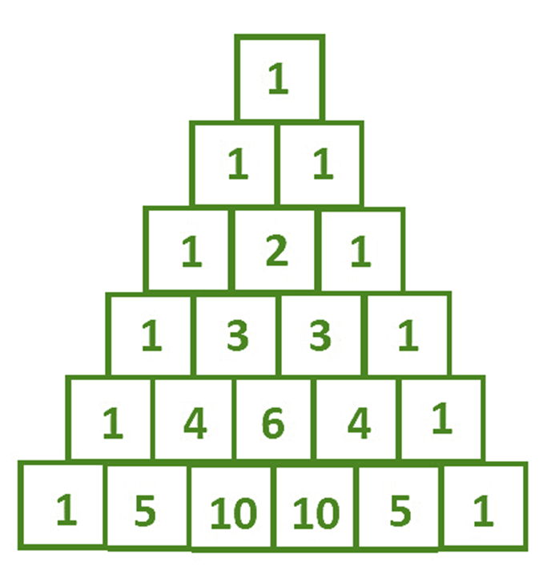

# DataStructureAndAlgorithm 資料結構與演算法C#筆記

記錄閲讀《圖解資料結構與演算法-運用C#》的學習筆記，程式語言為C#

## 資料結構入門與演算法
1. **遞回法 Recursion** 
如果一個函式由自身所定義與調用，則是遞回法 Recursion。使用 Recursion 的函式需具備以下兩個條件：
- 可以重複調用自身函式
- 跳出執行的條件出口
- 案例：[費波那切數列](./DataStructureAndAlgorithm/Services/FibonacciService.cs)

2. **分冶法**
將複雜的問題拆分成兩個(或以上)的子問題，子問題可以再拆成兩個(或以上)更小的子問題。拆成小問題後，越容易直接求解。

3. **動態規劃法**
如分冶法，不同之處在於動態規劃法會將每一個子問題的結果儲存下來，下一次求相同子問題的解時可以直接使用。

4. **迭代法**
無法一次求解，需要重複運算。常見的遞迴運算即是迭代法。

5. **貪心法**

6. **枚舉法**

7. **巴斯卡三角形**

> $rC_0 = 1$  
> $rC_k^n = rC_(n-1) * (r-n-1) / n$

- 案例：[巴斯卡三角形](./DataStructureAndAlgorithm/Services/PascalTriangleService.cs)

8. **質數求解演算法**
- 求是否為質數，只需要將該數逐一檢查除以 0 ~ $\sqrt n$，

// Todo PrimeNumberService
